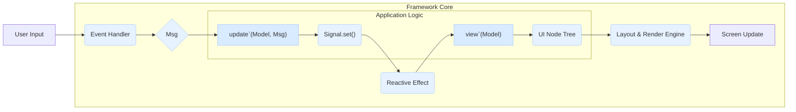

# Project North Star: Architecture Overview
Last Updated: August 4, 2025

## 1. Vision & Core Philosophy

Project North Star is a next-generation TUI (Terminal User Interface) framework for Zig. The goal is to enable the creation of highly performant, visually rich, and complex terminal applications that rival the developer experience and user experience of graphical apps.

The core philosophy is **"Reactive TEA"**: a hybrid of the predictable state management of **The Elm Architecture (TEA)** with the fine-grained performance of a modern **Signals-based reactive system**.

This architecture's primary goal is to provide an ergonomic, robust, and fun developer experience by providing strong compile-time guarantees and eliminating entire classes of bugs, while sidestepping the need for a Virtual DOM.

## 2. The "Reactive TEA" Data Flow

At its heart, the entire application follows a strict, unidirectional data flow. This is the central loop of the entire framework.

### 3. The Primitives

These are the fundamental building blocks of the architecture.

* **State (`Model`)**: A central `struct` that holds the application's entire state. Its fields are not plain data but are wrapped in `Signals`.
* **Events (`Msg`)**: A tagged union representing every possible thing that can happen in the application (e.g., `.button_clicked`, `.data_received`, `.key_pressed`).
* **Logic (`update` function)**: The single point of state mutation. It is a **pure function** with the signature `fn update(model: *Model, msg: Msg) !Cmd`. It computes the next state based on the current state and a `Msg`.
* **Side Effects (`Cmd`)**: A data structure that describes an asynchronous operation to be performed (e.g., an HTTP request). The `update` function returns a `Cmd`. The framework runs the `Cmd`, which will eventually dispatch a new `Msg` back to the `update` function on completion.
* **Reactivity (Signals API)**: The mechanism for fine-grained updates, avoiding full re-renders.
    * `create_signal(value: T) -> Signal(T)`: Creates a reactive state container.
    * `create_memo(fn) -> Signal(T)`: Creates a derived, cached read-only value.
    * `create_effect(fn) -> void`: The bridge to the outside world. Executes a procedure (like rendering) whenever a signal it depends on changes.
* **UI (`view` function)**: A **pure function** with the signature `fn view(model: *Model) !Node`. It reads from the `Model`'s signals and returns a declarative tree of `Node`s describing the desired UI. It does not perform any drawing itself.

### 4. The Component & Rendering Pipeline

* **Component Model**: Components are not objects with their own `render` methods. They are compositions of `view` functions that return `Node` trees. This makes the entire UI a single, inspectable data structure.
* **Rendering Pipeline**:
    1.  The main `effect` calls the top-level `view` function, generating a `Node` tree.
    2.  The **Layout Engine** walks this tree and calculates a `Rect {x, y, width, height}` for every `Node`.
    3.  The results are drawn to an in-memory **Virtual Buffer**.
    4.  This buffer is **diffed** against its state from the previous frame.
    5.  A minimal set of terminal escape codes is generated to apply only the changes to the real terminal.
* **Event Handling**:
    * **Mouse**: On click, the framework performs **hit detection** by checking the click coordinates against a list of component `Rect`s (iterated in reverse to respect z-index). A corresponding `Msg` is dispatched.
    * **Keyboard**: Events are dispatched as `Msg`s. A concept of **focus** (stored in the `Model`) determines which component receives the input.
* **Styling**: A `Style` struct is used to apply type-safe styling (`fg`, `bg`, attributes) to components.